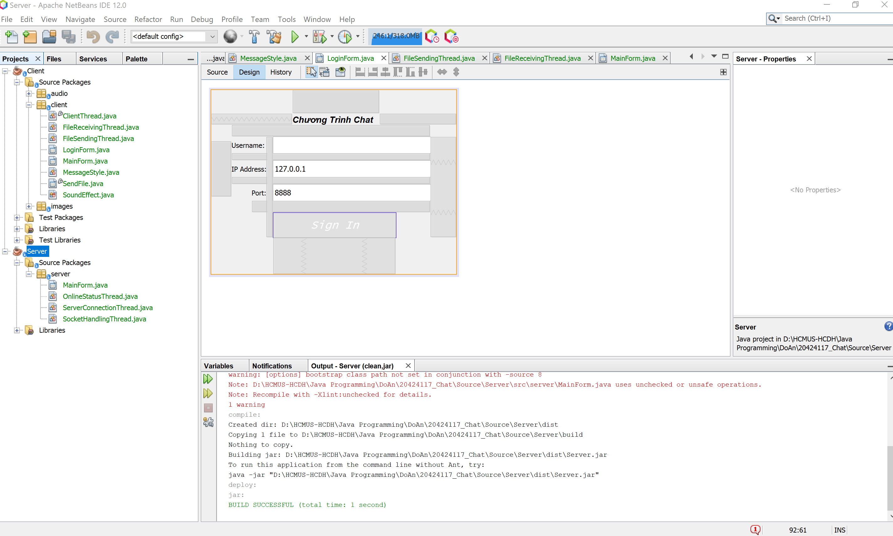
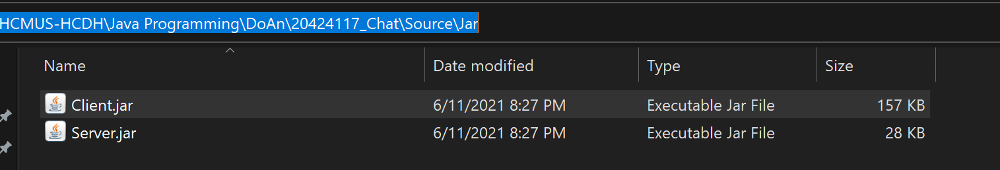

# Lập trình ứng dụng Java - Bài tập chat
## Thông tin sinh viên
* MSSV: 22424034
* Họ tên: Phạm Duy Tùng
* Email: 22424034@student.hcmus.edu.vn

## Hướng dẫn setup project
* Mở NetBeans IDE
* Chọn File -> Open Project...
* Chọn 2 Projects Client và Server
* Run project Server, nhập port hoặc sử dụng port mặc định 8888, Click Start server
* Run project Client, nhập username, nhập port Server, click Sign in

Hoặc chạy file jar đã compile sẵn theo thứ tự trên

## Các chức năng của project
* Đăng nhập vào group chat theo username, server IP, server port, đăng xuất
* Group chat giữa nhiều clients thông qua server
* Log các hoạt động của clients trên server console
* Gửi nhận file giữa riêng 2 clients với nhau
